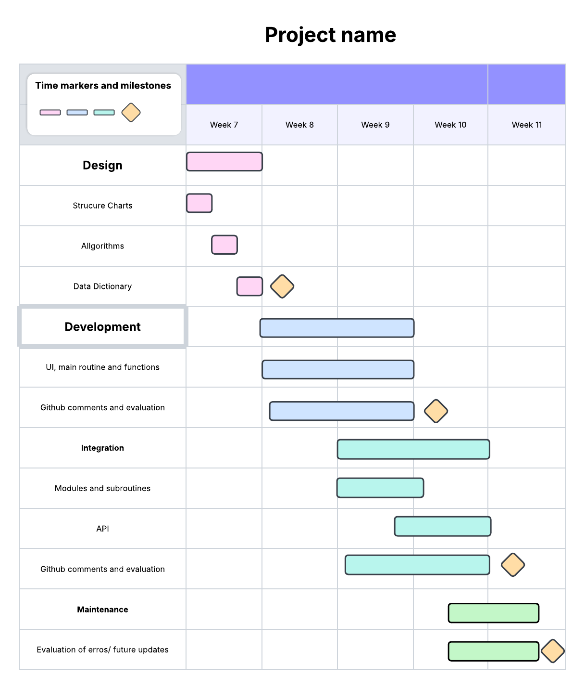

# <ins> **DataScienceAssessment1.2025**<ins>
---
## <ins> **Requirements Definition** <ins>
---
### <ins> **Functional Requirents** <ins>
**Data Retrieval**\
Users will need to download the needed files, data and api in order to use and view this program. 

**User Interface**\
User is required to have a keyboard and mouse in order to interact with the system and having the necessary navigational functions.

**Data Display**\
The user will need to be able to obtain the name of the pokemon, their moves, abilities, type, sound, any alternative forms, and their statistics. 

---
### <ins>**Non- Functional Requirements**<ins>
**Performance**\
The system needs to perform reasonably well, therefore not requiring much power to operate and be efficient in delivering results and the information that has been requested by the user

**Reliability**\
The system will have to be able to provide the necessary and reliable information/data to the user. If the user searches for a pokemon that doesn't exist or have made a typo, the system should return in an error letting them know.

**Usability and Accessibility**\
The system's navigational system should be easy to access and understand. The main function will be a search system which will go find the needed pokemon and the relative information regarding that pokemon, then returning it to the user, allowing them to view it and gaining the information they were wanting.

---
---
## <ins> **Determining Specifications** <ins>
---
### <ins> **Functional Specifications** <ins>
**User Requirements**\
The system should allow the user to search for the pokemon they want and then return the necessary informaiton related to that pokemon. For example if someone searches for Charizard, it will give you the type, move set and other informaiton

**Inputs and Outputs**\
The system will need to accept text as the input and then find them in the data set to then return all the necessary information regarding that pokemon in a text based format.

**Core Features**\
The core features of this program is to search and find information relating to the pokemon that the user has requested and then display that information so that they can view it and gain the knowledge.

**User Interaction**\
The users will interact with the system through a text based user interface, which allows them to view the needed information that has been provided by the program relating to whatever they searched.

**Error Handling**\
The system will need to be able to return an error in case the user enters a pokemon that doesn't exist or if they make a typo. 

---
### <ins> **Non-Functional Specificaitons** <ins>
**Performance**\
The program shouldn't take longer than a few seconds to return the necessary information that has been requested by the user regarding the pokemon, a good UI will also be needed to ensure that the program runs as efficient as possible instead of hiding the search things under other processes.

**Usability/Accessibility**\
The user interface will be qutie simple, it will just ask them what pokemon they want to learn about and then what information they would want to know about that pokemon (type, stats, etc). It will just be a simple search that requires you to type 2 things and then when you have recieved the information, give another prompt asking if you're done with the program or want to search for another pokemon or more information on the previous creature.

**Reliability**\
An issue that might cause a problem to the program will be typos, or a pokemon that doesn't exist. In this case it will simply return an error message stating that the pokemon doesn't exist

---
---
## <ins> **Use Cases** <ins>
**Actors**\
User(Someone that likes Pokemon)

**Preconditions**\
Access to the internet and the API (PokeApi)

**Main Flow**
1. User will get prompted to enter the name of the porkemon they want to search, system will retrieve the data and filter it to that specific pokemon
2. User will get another prompt asking what they want to know about that pokemon, system will retrieve this data and display it
3. User will get one final prompt asking \
a) If they want to look for another pokemon\
b) Want more information on the previous pokemon\
c) End task\
If a) system will return to step 1. If b) system will return to step 2. If c) system will end

**Postconditions**\
Pokemon data has been given to the user

---
---
## <ins> **Design**
**Gantt Chart**\

---
**Structure Chart**\

---
**Algorithms**
- #### **Main Function**
```
BEGIN main()
    USERINPUT pokemonname
    If APIREQUEST valid THEN 
        choice=0
        WHILE choice is not END
            USERINPUT choice
            IF choice is ABILITIES THEN
                DISPLAY ABILITIES
            ELSEIF choice is SOUND THEN
                PLAYSOUND
            ELSEIF choice is MOVES THEN
                DISPLAY MOVES
            ELSEIF choice is TYPES THEN
                DISPLAY TYPES
            ELIF choice is STATS THEN
                DISPLAY STATS
            ELIF choice is EVERYTHING THEN
                Display Everything
            ELSE
                DISPLAY 'Choose One Please'
            ENDIF
    ELSE 
        DISPLAY 'Error'
    ENDIF
END main()    
```
.png "Flowchart of Main Function")
---
- #### **Sub-function (Display Pokemon)**
```

```
.png "Sub Function (type)")
---
- #### **Sub-function (random pokemon)**
```

```
.png "Sub Function (random pokemon)")
---
**Data Dictionary**

| Variable | Data Type | Format for Display | Size in Bytes | Size for Display | Description  | Example | Validation |
| :---- | :---- | :---- | :---- | :---- | :---- | :---- | :---- |
| name | String | Text | 50 | 50 | The name of the pokemon | Glaceon | Must be valid |
| ID | Integer | Whole Number | 4 | 4 | The ID number of the pokemon | 471 | Must be positive |
| type | String | Text | 50 | 50 | The type/s of the pokemon  | Ice | Must be the type of the pokemon |
| abilities | String | Text | 100 | 100 | The abilities that the pokemon has | Snow Cloak | Must be a ability of the pokemon |
| stats | Integer | Whole Number | 4 | 4 | The stats of the pokemon | HP: 65 | Must be valid base stats for pokemon |
| moves | Integer | Whole Number | 4 | 4 | The amount of moves that the pokemon has access to | 87 | Must be valid moves from game |
| sound | .Wav | n/a | 24400 | n/a | The sound that the pokemon made in the games | n/a | Must be the sound the pokemon made |
| image |  | Image | 92000 | 92000 | The image of a pokemon |  | Must be the official artwork of the pokemon |

---
---
## <ins> **Development** <ins>
```
# Import necessary modules
import requests  # For making HTTP requests to the Pokémon API
import tkinter as tk  # For making the GUI
from tkinter import Label, Entry, Button  # Specific functions from tkinter
from PIL import Image, ImageTk  # For displaying images
from io import BytesIO  # For handling image data
import pygame  # For playing Pokemon sound files
import time  # For adding delays
import os  # For file operations
from pathlib import Path  # For better file path handling
import random  # For generating random numbers

# Create the main Tkinter window
root = tk.Tk()
root.title("Pokedex")  # Set window title
root.iconbitmap("other/pngegg.ico")  # Set window icon
root.geometry("280x460")  # Set window size

# Load and prepare the default image to show at startup
default_image_path = Path("other/filler_image.png")
default_image = Image.open(default_image_path)
default_image = default_image.resize((250, 92))  # Resize the image
default_photo = ImageTk.PhotoImage(default_image)  # Convert image to Tkinter format

# Display the default image in a Label widget
label_image = Label(root, image=default_photo)
label_image.image = default_photo  # Keep a reference to prevent garbage collection
label_image.pack()  # Add to window

# Display the default image again (used when no Pokémon is found or on start)
def display_default_image():
    label_image.config(image=default_photo)
    label_image.image = default_photo

# Fetch data about a Pokemon from the API
def fetch_pokemon():
    name = entry.get().lower().strip()  # Get user input
    if not name:
        label_name.config(text="Please enter a Pokémon name!")
        display_default_image()
        return None

    url = f"https://pokeapi.co/api/v2/pokemon/{name}"  # API link
    response = requests.get(url)  # Send request to API
    if response.status_code == 200:
        pokemon_data = response.json()  # Converts JSON to pyhton
        display_pokemon(pokemon_data)  # Show Pokemon data
        return pokemon_data
    else:
        # Reset labels and show error if Pokemon not found
        label_name.config(text="Pokemon not found")
        label_id.config(text="")
        label_types.config(text="")
        label_abilities.config(text="")
        label_stats.config(text="")
        display_default_image()
        return None

# Display Pokemon image and info on the GUI
def display_pokemon(data):
    label_name.config(text=f"Name: {data['name'].capitalize()}")  # Show name
    label_id.config(text=f"ID: {data['id']}")  # Show ID
    
    # Show types
    types = ", ".join(t["type"]["name"].capitalize() for t in data["types"])
    label_types.config(text=f"Type: {types}")
    
    # Show abilities
    abilities = ", ".join(a["ability"]["name"].capitalize() for a in data["abilities"])
    label_abilities.config(text=f"Abilities: {abilities}")
    
    # Show base stats
    stats = "\n".join(f"{s['stat']['name'].capitalize()}: {s['base_stat']}" for s in data["stats"])
    label_stats.config(text=f"Stats:\n{stats}")
    
    # Download and show Pokemon image
    image_url = data["sprites"]["other"]["official-artwork"]["front_default"]
    if image_url:
        img_data = requests.get(image_url).content
        img = Image.open(BytesIO(img_data))
        img = img.resize((150, 150))
        img = ImageTk.PhotoImage(img)
        label_image.config(image=img)
        label_image.image = img

# Play Pokemon sound
def play_sound():
    pygame.init()  # Initialise pygame
    pygame.mixer.init()  # Initialise sound mixer
    
    name = entry.get().lower().strip()
    pokemon_info = fetch_pokemon()  # Get Pokemon info
    
    if not pokemon_info:
        label_name.config(text="Please search for a pokemon")
        return
    
    poke_id = pokemon_info.get("id")  # Get Pokemon ID
    
    # URL of sound file
    sound_url = f"https://raw.githubusercontent.com/PokeAPI/cries/main/cries/pokemon/latest/{poke_id}.ogg"
    out_file = Path(f"other/{name.capitalize()}.ogg").expanduser()  # Path to save sound locally
    
    sound_data = requests.get(sound_url).content  # Download sound
    with open(out_file, "wb") as file:
        file.write(sound_data)  # Save sound file
    
    pygame.mixer.music.load(out_file)  # Load sound
    pygame.mixer.music.play()  # Play sound
    while pygame.mixer.music.get_busy():
        continue  # Wait until sound finishes
    
    pygame.mixer.music.stop()  # Stop sound
    pygame.mixer.quit()  # Cleanup
    time.sleep(0.5)  # Small delay
    os.remove(out_file)  # Delete the sound file

# Pick a random Pokemon and fetch its data
def random_button():
    random_number = random.randint(1, 1025)  # Generate random ID
    entry.delete(0, tk.END)  # Clear text box
    entry.insert(0, str(random_number))  # Replaces with new ID
    fetch_pokemon()  # Fetch random Pokémon

# Create label and entry box for Pokemon input
Label(root, text="Enter Pokemon Name:").pack()
entry = Entry(root)
entry.pack()
entry.bind("<Return>", lambda event: fetch_pokemon())  # Fetch on Enter key

# Create button frame
frame_buttons = tk.Frame(root)
frame_buttons.pack()

# Search button
btn_fetch = Button(frame_buttons, text="Search", command=fetch_pokemon)
btn_fetch.grid(row=0, column=0, padx=5, pady=5)

# Random button
btn_random = Button(frame_buttons, text="Random", command=random_button)
btn_random.grid(row=0, column=1, padx=5, pady=5)

# Play sound button
btn_sound = Button(root, text="Play Sound", command=play_sound)
btn_sound.pack()

# Labels to display Pokémon data
label_name = Label(root, text="")
label_name.pack()
label_id = Label(root, text="")
label_id.pack()
label_types = Label(root, text="")
label_types.pack()
label_abilities = Label(root, text="")
label_abilities.pack()
label_stats = Label(root, text="")
label_stats.pack()

# Start the GUI application
root.mainloop()
```
---
---
## <ins> **Maintenance** <ins>
**Maintenance Questions**\


---
**Final Evaluation**\


---
---