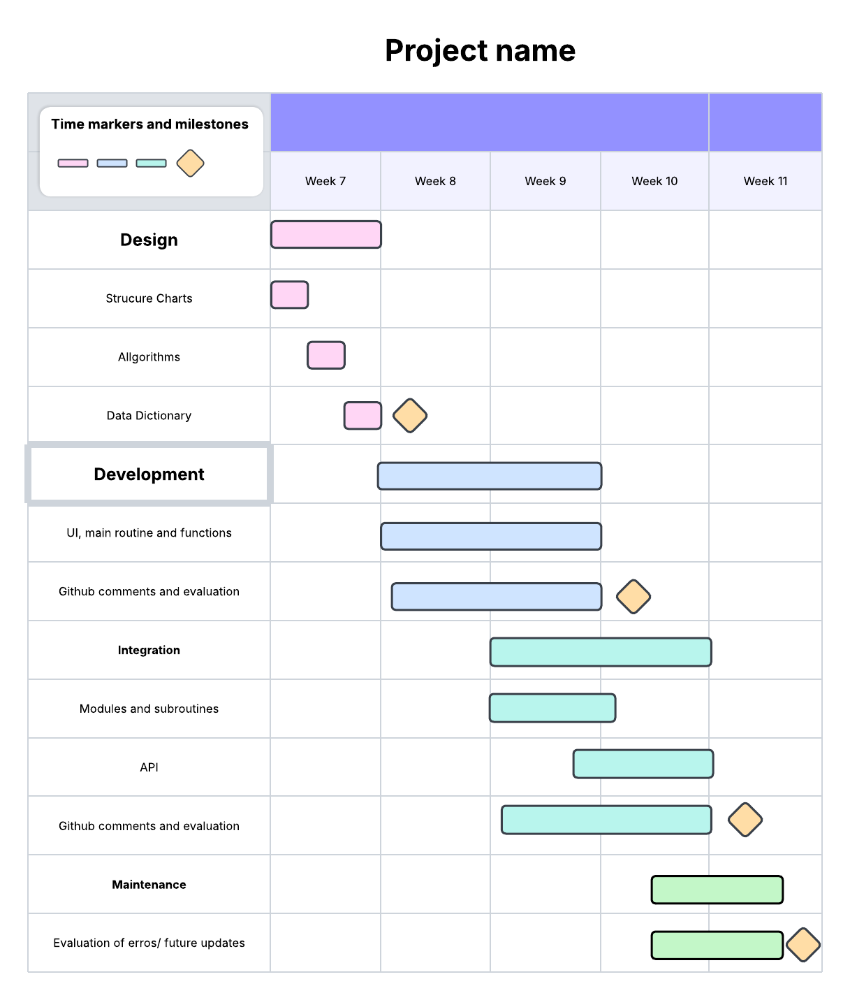

# <ins> **DataScienceAssessment1.2025**<ins>
---
## <ins> **Requirements Definition** <ins>
---
### <ins> **Functional Requirents** <ins>
**Data Retrieval**\
Users will need to download the needed files, data and api in order to use and view this program. 

**User Interface**\
User is required to have a keyboard and mouse in order to interact with the system and having the necessary navigational functions.

**Data Display**\
The user will need to be able to obtain the name of the pokemon, their moves, abilities, type, sound, any alternative forms, and their statistics. 

---
### <ins>**Non- Functional Requirements**<ins>
**Performance**\
The system needs to perform reasonably well, therefore not requiring much power to operate and be efficient in delivering results and the information that has been requested by the user

**Reliability**\
The system will have to be able to provide the necessary and reliable information/data to the user. If the user searches for a pokemon that doesn't exist or have made a typo, the system should return in an error letting them know.

**Usability and Accessibility**\
The system's navigational system should be easy to access and understand. The main function will be a search system which will go find the needed pokemon and the relative information regarding that pokemon, then returning it to the user, allowing them to view it and gaining the information they were wanting.

---
---
## <ins> **Determining Specifications** <ins>
---
### <ins> **Functional Specifications** <ins>
**User Requirements**\
The system should allow the user to search for the pokemon they want and then return the necessary informaiton related to that pokemon. For example if someone searches for Charizard, it will give you the type, move set and other informaiton

**Inputs and Outputs**\
The system will need to accept text as the input and then find them in the data set to then return all the necessary information regarding that pokemon in a text based format.

**Core Features**\
The core features of this program is to search and find information relating to the pokemon that the user has requested and then display that information so that they can view it and gain the knowledge.

**User Interaction**\
The users will interact with the system through a text based user interface, which allows them to view the needed information that has been provided by the program relating to whatever they searched.

**Error Handling**\
The system will need to be able to return an error in case the user enters a pokemon that doesn't exist or if they make a typo. 

---
### <ins> **Non-Functional Specificaitons** <ins>
**Performance**\
The program shouldn't take longer than a few seconds to return the necessary information that has been requested by the user regarding the pokemon, a good UI will also be needed to ensure that the program runs as efficient as possible instead of hiding the search things under other processes.

**Usability/Accessibility**\
The user interface will be qutie simple, it will just ask them what pokemon they want to learn about and then what information they would want to know about that pokemon (type, stats, etc). It will just be a simple search that requires you to type 2 things and then when you have recieved the information, give another prompt asking if you're done with the program or want to search for another pokemon or more information on the previous creature.

**Reliability**\
An issue that might cause a problem to the program will be typos, or a pokemon that doesn't exist. In this case it will simply return an error message stating that the pokemon doesn't exist

---
---
## <ins> **Use Cases** <ins>
**Actors**\
User(Someone that likes Pokemon)

**Preconditions**\
Access to the internet and the API (PokeApi)

**Main Flow**
1. User will get prompted to enter the name of the porkemon they want to search, system will retrieve the data and filter it to that specific pokemon
2. User will get another prompt asking what they want to know about that pokemon, system will retrieve this data and display it
3. User will get one final prompt asking \
a) If they want to look for another pokemon\
b) Want more information on the previous pokemon\
c) End task\
If a) system will return to step 1. If b) system will return to step 2. If c) system will end

**Postconditions**\
Pokemon data has been given to the user

---
---
## <ins> **Design**
**Gantt Chart**\

---
**Structure Chart**\

---
**Algorithms**\

---
**Data Dictionary**\

---
---
## <ins> **Development** <ins>

---
---
## <ins> **Maintenance** <ins>
**Maintenance Questions**\

---
**Final Evaluation**\

---
---