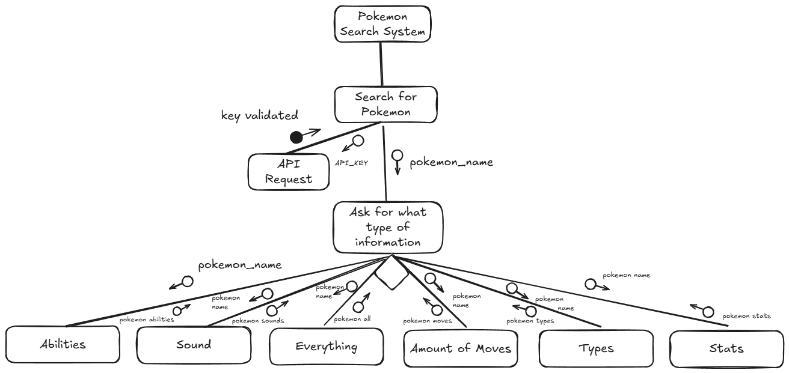

# <ins> **DataScienceAssessment1.2025**<ins>
---
## <ins> **Requirements Definition** <ins>
---
### <ins> **Functional Requirents** <ins>
**Data Retrieval**\
Users will need to download the needed files, data and api in order to use and view this program. 

**User Interface**\
User is required to have a keyboard and mouse in order to interact with the system and having the necessary navigational functions.

**Data Display**\
The user will need to be able to obtain the name of the pokemon, their moves, abilities, type, sound, any alternative forms, and their statistics. 

---
### <ins>**Non- Functional Requirements**<ins>
**Performance**\
The system needs to perform reasonably well, therefore not requiring much power to operate and be efficient in delivering results and the information that has been requested by the user

**Reliability**\
The system will have to be able to provide the necessary and reliable information/data to the user. If the user searches for a pokemon that doesn't exist or have made a typo, the system should return in an error letting them know.

**Usability and Accessibility**\
The system's navigational system should be easy to access and understand. The main function will be a search system which will go find the needed pokemon and the relative information regarding that pokemon, then returning it to the user, allowing them to view it and gaining the information they were wanting.

---
---
## <ins> **Determining Specifications** <ins>
---
### <ins> **Functional Specifications** <ins>
**User Requirements**\
The system should allow the user to search for the pokemon they want and then return the necessary informaiton related to that pokemon. For example if someone searches for Charizard, it will give you the type, move set and other informaiton

**Inputs and Outputs**\
The system will need to accept text as the input and then find them in the data set to then return all the necessary information regarding that pokemon in a text based format.

**Core Features**\
The core features of this program is to search and find information relating to the pokemon that the user has requested and then display that information so that they can view it and gain the knowledge.

**User Interaction**\
The users will interact with the system through a text based user interface, which allows them to view the needed information that has been provided by the program relating to whatever they searched.

**Error Handling**\
The system will need to be able to return an error in case the user enters a pokemon that doesn't exist or if they make a typo. 

---
### <ins> **Non-Functional Specificaitons** <ins>
**Performance**\
The program shouldn't take longer than a few seconds to return the necessary information that has been requested by the user regarding the pokemon, a good UI will also be needed to ensure that the program runs as efficient as possible instead of hiding the search things under other processes.

**Usability/Accessibility**\
The user interface will be qutie simple, it will just ask them what pokemon they want to learn about and then what information they would want to know about that pokemon (type, stats, etc). It will just be a simple search that requires you to type 2 things and then when you have recieved the information, give another prompt asking if you're done with the program or want to search for another pokemon or more information on the previous creature.

**Reliability**\
An issue that might cause a problem to the program will be typos, or a pokemon that doesn't exist. In this case it will simply return an error message stating that the pokemon doesn't exist

---
---
## <ins> **Use Cases** <ins>
**Actors**\
User(Someone that likes Pokemon)

**Preconditions**\
Access to the internet and the API (PokeApi)

**Main Flow**
1. User will get prompted to enter the name of the porkemon they want to search, system will retrieve the data and filter it to that specific pokemon
2. User will get another prompt asking what they want to know about that pokemon, system will retrieve this data and display it
3. User will get one final prompt asking \
a) If they want to look for another pokemon\
b) Want more information on the previous pokemon\
c) End task\
If a) system will return to step 1. If b) system will return to step 2. If c) system will end

**Postconditions**\
Pokemon data has been given to the user

---
---
## <ins> **Design**
**Gantt Chart**\

---
**Structure Chart**\

---
**Algorithms**
- #### **Main Function**
```
BEGIN main()
    USERINPUT pokemonname
    If APIREQUEST valid THEN 
        choice=0
        WHILE choice is not END
            USERINPUT choice
            IF choice is ABILITIES THEN
                DISPLAY ABILITIES
            ELSEIF choice is SOUND THEN
                PLAYSOUND
            ELSEIF choice is MOVES THEN
                DISPLAY MOVES
            ELSEIF choice is TYPES THEN
                DISPLAY TYPES
            ELIF choice is STATS THEN
                DISPLAY STATS
            ELIF choice is EVERYTHING THEN
                Display Everything
            ELSE
                DISPLAY 'Choose One Please'
            ENDIF
    ELSE 
        DISPLAY 'Error'
    ENDIF
END main()    
```
.png "Flowchart of Main Function")
---
- #### **Sub-function (type)**
```
BEGIN type()
    PULL type for pokemon_info
    DISPLAY type
END type()
```
.png "Sub Function (type)")
---
- #### **Sub-function (sound)**
```
BEGIN sound()
    PULL sound from pokemon_info
    DOWNLOAD sound
    OUTPUT playsound
    DELETE sound
END sound()
```
.png "Sub Function (sound)")
---
**Data Dictionary**\
| Variable | Data Type | Format for Display | Size in Bytes | Size for Display | Description  | Example | Validation |
| :---- | :---- | :---- | :---- | :---- | :---- | :---- | :---- |
| name | String | Text | 50 | 50 | The name of the pokemon | Glaceon | Must be valid |
| ID | Integer | Whole Number | 4 | 4 | The ID number of the pokemon | 471 | Must be positive |
| type | String | Text | 50 | 50 | The type/s of the pokemon  | Ice | Must be the type of the pokemon |
| abilities | String | Text | 100 | 100 | The abilities that the pokemon has | Snow Cloak | Must be a ability of the pokemon |
| stats | Integer | Whole Number | 4 | 4 | The stats of the pokemon | HP: 65 | Must be valid stats for pokemon |
| moves | Integer | Whole Number | 4 | 4 | The amount of moves that the pokemon has access to | 87 | Must be valid moves from game |
| sound | .Wav | n/a | 24400 | n/a | The sound that the pokemon made in the games | “Pika pika”- Pikachu | Must be the sound the pokemon made |

---
---
## <ins> **Development** <ins>
```
import requests
import pygame
import time
import os
from pathlib import Path

base_url="https://pokeapi.co/api/v2/"

def get_pokemoninfo(name):
    url = f"{base_url}/pokemon/{name}"
    response=requests.get(url)
    if response.status_code ==200:
        pokemondata =response.json()
        return pokemondata
    else:
        print("Not Found. Check for typos")


def pokemonstandard():
    if pokemon_info:
        print("Name: " + pokemon_info['name'].capitalize())
        print("ID: " + f"{pokemon_info['id']}")


def types():
    for type_info in pokemon_info['types']:
        print("Type: " + type_info['type']['name'].capitalize())

def abilities():
    abilities = [a["ability"]["name"].capitalize() for a in pokemon_info["abilities"]]
    print(f"Abilities: {', '.join(abilities)}")

def stats():
    stats = {s["stat"]["name"].capitalize(): s["base_stat"] for s in pokemon_info["stats"]}
    for stat, value in stats.items():
        print(f"{stat}: {value}")
def moves():
    moves_count = len(pokemon_info['moves'])
    print(f"Number of moves: {moves_count}\n(cannot display each individual move)")
def sound():
    pygame.init()
    pygame.mixer.init()
    pokeID = f"{pokemon_info['id']}"
    pokesound = f"{str(pokeID).zfill(4)}_{pokemon_info['forms'][0]['name']}.latest"
    out_file = Path(f"sounds\{pokesound.capitalize()}.ogg").expanduser()
    resp = requests.get(f"https://raw.githubusercontent.com/PokeAPI/cries/main/cries/pokemon/latest/{pokeID}.ogg")
    resp.raise_for_status()
    with open(out_file, "wb") as fout:
        fout.write(resp.content)
    time.sleep(1)
           
    file_path = r"sounds"'\\' + pokesound + ".ogg"
    pygame.mixer.music.load(str(file_path))
    pygame.mixer.music.play()
    while pygame.mixer.music.get_busy() == True:
        continue

    pygame.mixer.music.stop()
    pygame.mixer.quit()
    time.sleep(0.5)

    os.remove(out_file)


while True:
    pokemonname= input("What pokemon would you like to learn about? ")
    pokemon_info= get_pokemoninfo(pokemonname)

    if not pokemon_info:
        continue

    while True:    
        choice = input("What would you like to know about this pokemon?(Types, Stats, Abilities, Moves, Sound or Everything): ").lower()

        if choice=="types":
            pokemonstandard()
            types()
        elif choice=="abilities":
            pokemonstandard()
            abilities()
        elif choice=="stats":
            pokemonstandard()
            stats()
        elif choice=="moves":
            pokemonstandard()
            moves()
        elif choice=="sound":
            sound()
        elif choice=="everything":
            pokemonstandard()
            types()
            stats()
            abilities()
            moves()
            sound()
        else:
            print("Please enter a valid option")
            continue
        
        learn_more = input("Would you like to learn more about this pokemon? (yes/no): ").lower()
        if learn_more !="yes":
            break
    same_pokemon=input("Would you like to learn something about another pokemon? (yes/no): ").lower()
    if same_pokemon !="yes":
        print("Thank you for using my program. Farewell")
        break
```
---
---
## <ins> **Maintenance** <ins>
**Maintenance Questions**\


---
**Final Evaluation**\


---
---